# ⭐️[일정 관리 앱 서버 구현 프로젝트 Version.2]⭐️
회원가입, 로그인을 통한 회원 관리 및 일정, 댓글 기능이 구현된 서버


## ⚙️개발 환경 및 라이브러리
### 📌 개발 환경
✔️ 언어: Java 17  
✔️ 빌드 도구: Gradle  
✔️ 프레임워크: Spring Boot 3.4.2  
✔️ 데이터베이스: MySQL

### 📌 사용 라이브러리
✔️ `spring-boot-starter-web`  
✔️ `spring-boot-starter-data-jpa`  
✔️ `spring-boot-starter-validation`  
✔️ `lombok`  
✔️ `bcrypt`  
✔️ `mysql-connector-j`

<br>

### 👉🏻 ERD

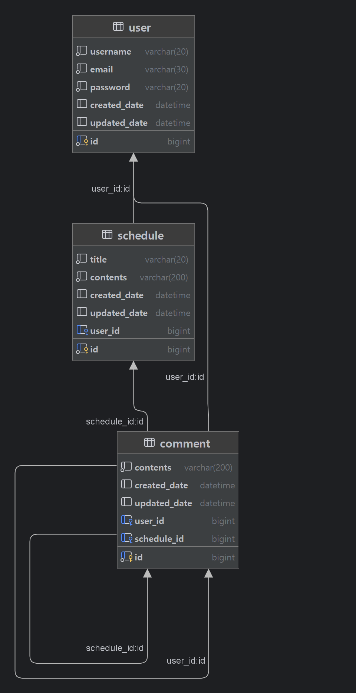

<br>


### 👉🏻 SQL

```sql
CREATE TABLE user
(
    id BIGINT AUTO_INCREMENT PRIMARY KEY,
    username VARCHAR(20) NOT NULL,
    email VARCHAR(30) NOT NULL,
    password VARCHAR(20) NOT NULL,
    created_date DATETIME,
    updated_date DATETIME
);

CREATE TABLE schedule
(
    id BIGINT AUTO_INCREMENT PRIMARY KEY,
    title VARCHAR(20) NOT NULL,
    contents VARCHAR(200) NOT NULL,
    created_date DATETIME,
    updated_date DATETIME,
    user_id BIGINT,
    foreign key (user_id) references user(id)
);

CREATE TABLE comment
(
    id BIGINT AUTO_INCREMENT PRIMARY KEY,
    contents VARCHAR(200) NOT NULL,
    created_date DATETIME,
    updated_date DATETIME,
    user_id BIGINT,
    schedule_id BIGINT,
    foreign key (user_id) references comment(id),
    foreign key (schedule_id) references comment(id)
)
```
<br>

### 👉🏻 API 명세서

## 일정(Schedule) API

| 기능              | 메서드  | 엔드포인트                 | 요청 데이터      | 요청 예시                                      | 응답 데이터   | 상태 코드 및 설명                             |
|-----------------|--------|--------------------------|--------------|------------------------------------------|-----------|----------------------------------------|
| 일정 생성       | POST   | /schedules              | Body         | `{ "userId":1, "title":"title", "contents":"contents" }` | 등록 정보   | 201: 정상등록, 400: 유효성 검사 실패              |
| 전체 일정 조회   | GET    | /schedules/find         | 없음         | 없음                                       | 다건 응답 정보 | 200: 정상조회                              |
| 선택 일정 조회   | GET    | /schedules/find/{id}    | Path ID      | `/schedules/find/1`                      | 단건 응답 정보 | 200: 정상조회, 404: id 불일치                 |
| 페이지 별 일정 조회 | GET  | /schedules/find/paging | Query Param  | `?pageNum=1&pageSize=1`                  | 다건 응답 정보 | 200: 정상조회                              |
| 일정 수정       | PATCH  | /schedules/{id}         | Path ID, Body | `{ "title":"title", "contents":"contents" }` | 수정 정보   | 200: 정상수정, 400: 유효성 검사 실패, 404: id 불일치 |
| 일정 삭제       | DELETE | /schedules/{id}         | Path ID      | `/schedules/1`                            | 삭제 성공 여부 | 200: 정상삭제, 400: 유효성 검사 실패, 404: id 불일치 |

---

## 유저(User) API

| 기능            | 메서드  | 엔드포인트        | 요청 데이터      | 요청 예시                                      | 응답 데이터   | 상태 코드 및 설명                                  |
|--------------|--------|--------------|--------------|------------------------------------------|-----------|------------------------------------------|
| 전체 유저 조회 | GET    | /user/find   | 없음         | 없음                                       | 다건 응답 정보 | 200: 정상조회                                  |
| 선택 유저 조회 | GET    | /user/find/{id} | Path ID      | `/user/find/1`                            | 단건 응답 정보 | 200: 정상조회, 404: id 불일치                    |
| 유저 수정     | PATCH  | /user/{id}   | Path ID, Body | `{ "username":"username", "email":"email" }` | 수정 정보   | 200: 정상수정, 400: 유효성 검사 실패, 404: id 불일치 |
| 유저 삭제     | DELETE | /user/{id}   | Path ID      | `/user/1`                                 | 삭제 성공 여부 | 200: 정상삭제, 400: 유효성 검사 실패, 404: id 불일치 |

---

## 인증(Auth) API

| 기능       | 메서드  | 엔드포인트        | 요청 데이터       | 요청 예시                                      | 응답 데이터   | 상태 코드 및 설명                                    |
|---------|--------|--------------|--------------|------------------------------------------|-----------|-----------------------------------------------|
| 회원가입   | POST   | /auth/signup  | Body         | `{ "username":"username", "email":"email", "password":"password" }` | 등록 정보   | 201: 정상등록, 400: 유효성 검사 실패, 409: 이미 존재하는 계정 정보 |
| 로그인    | POST   | /auth/login   | Body, HttpServletRequest | `{ "email":"email", "password":"password" }` | 로그인 성공 여부 | 200: 정상완료, 400: 유효성 검사 실패, 401: 입력정보 불일치      |
| 로그아웃   | POST   | /auth/logout  | HttpServletRequest | 없음                                       | 로그아웃 성공 여부 | 200: 정상완료                                     |

---

## 댓글(Comment) API

| 기능             | 메서드  | 엔드포인트                          | 요청 데이터      | 요청 예시                                      | 응답 데이터   | 상태 코드 및 설명                             |
|---------------|--------|--------------------------------|--------------|------------------------------------------|-----------|----------------------------------------|
| 댓글 작성       | POST   | /comment/{scheduleId}          | Path ID, Body | `{ "userId":1, "contents":"contents" }` | 등록 정보   | 201: 정상등록, 400: 유효성 검사 실패              |
| 일정 댓글 조회   | GET    | /comment/schedule/{scheduleId} | Path ID      | `/comment/1`                             | 다건 응답 정보 | 200: 정상조회, 400: 유효성 검사 실패, 404: id 불일치 |
| 선택 댓글 조회   | GET    | /comment/{id}                  | Path ID      | `/comment/1`                             | 단건 응답 정보 | 200: 정상조회, 400: 유효성 검사 실패, 404: id 불일치 |
| 댓글 수정       | PATCH  | /comment/{id}                  | Path ID, Body | `{ "userId":1, "contents":"contents" }` | 수정 정보   | 200: 정상수정, 400: 유효성 검사 실패, 404: id 불일치 |
| 댓글 삭제       | DELETE | /comment/{id}                  | Path ID      | `/comment/1`                             | 삭제 성공 여부 | 200: 정상삭제, 400: 유효성 검사 실패, 404: id 불일치 |

<br>

## 👉🏻 구현 사항
✅ 일정 엔티티 crud 
✅ 유저 엔티티 crud
✅ 댓글 엔티티 crud
✅ 테이블 연관관계 매핑 및 외래키 설정
✅ Page 객체를 활용한 페이지별 일정 목록 조회(페이지 번호, 페이지 크기 기준)  
✅ @ExceptionHandler를 활용한 Custom Exception 생성 및 예외 처리  
✅ @Valid, @Pattern을 활용한 유효성 검증  
✅ Cookie/Session을 활용한 로그인 기능 구현 (Spring Security 미사용)  
✅ BCrypt를 활용한 비밀번호 암호화 적용
✅ JPA Auditing을 활용한 생성일/수정일 자동 처리

<br>

## 👉🏻 POSTMAN 확인

<details>

<summary><b>schedule</b></summary>

- schedule create
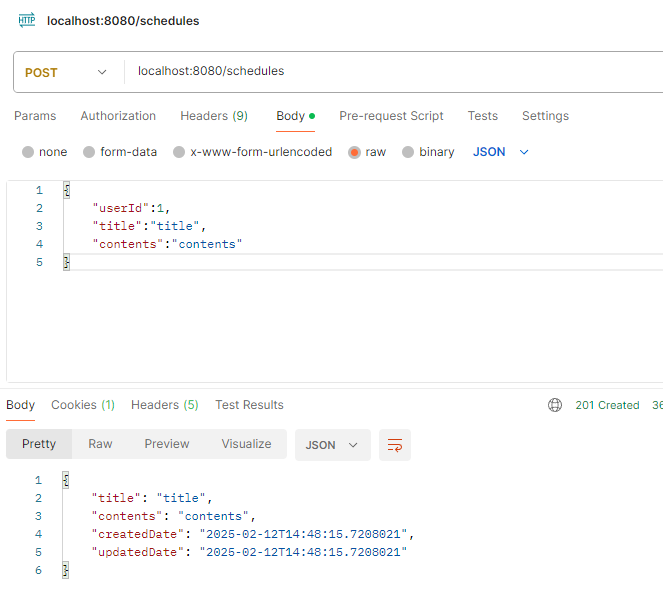

- schedule read
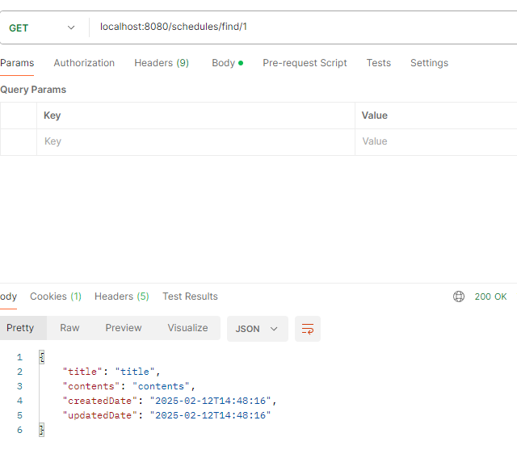
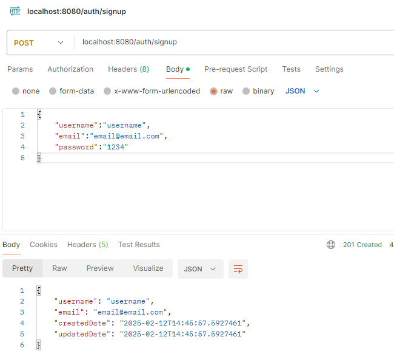

- paging
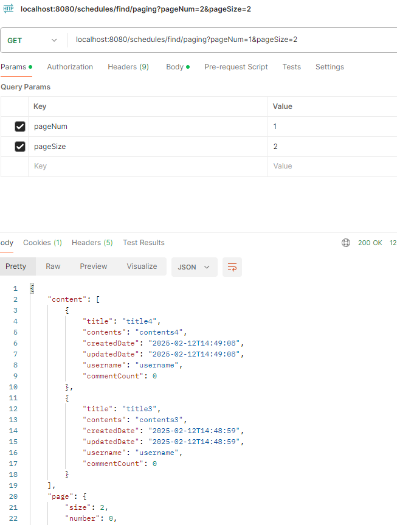

- schedule update
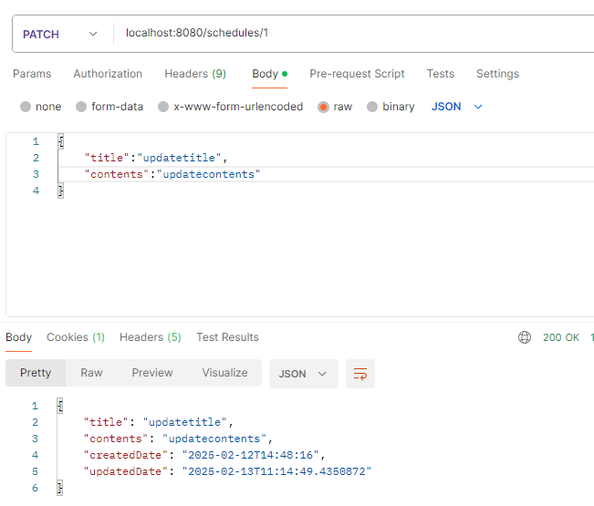

- schedule delete
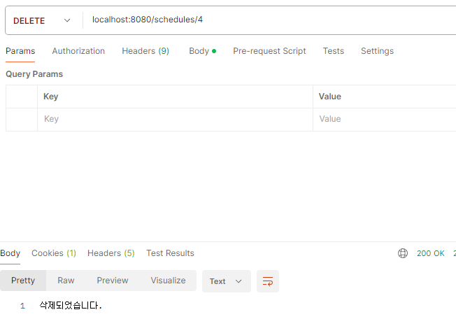

</details>

<details>

<summary><b>auth</b></summary>

- signup(user create)
  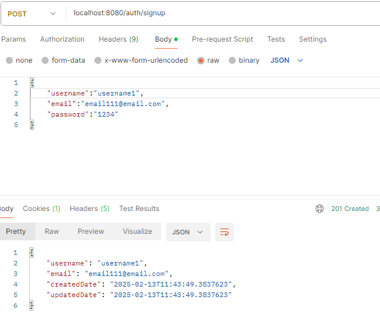

- login
  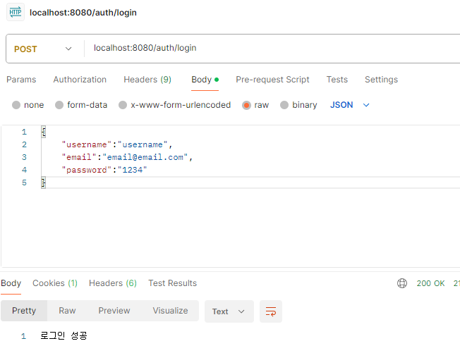

- logout
 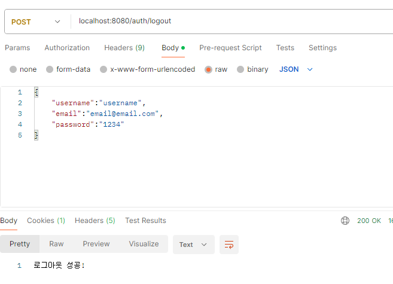

</details>

<details>

<summary><b>user</b></summary>

- user read
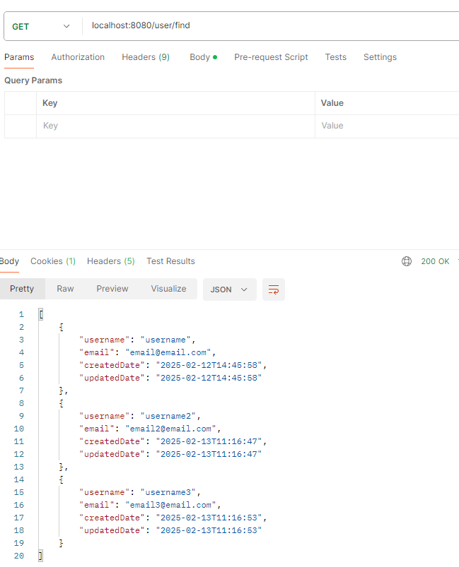
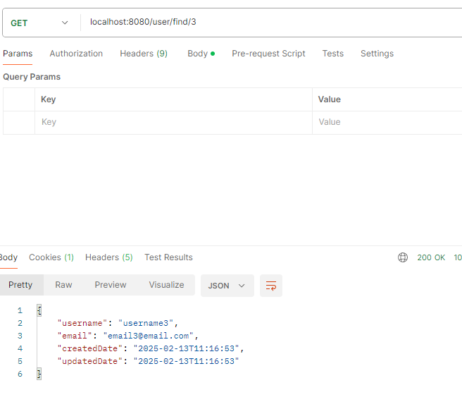

- user update
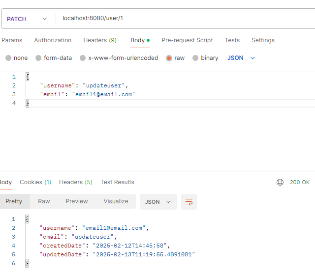

- user delete
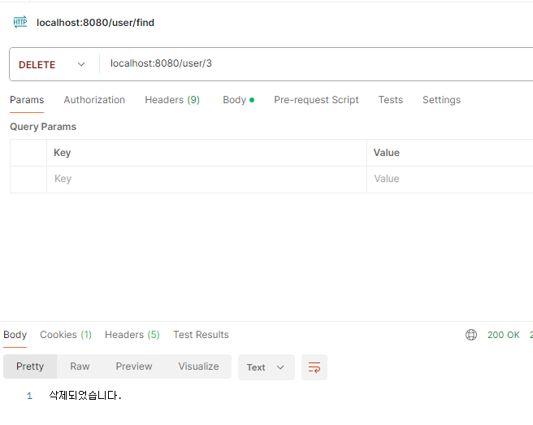

</details>

<details>

<summary><b>comment</b></summary>


- comment create
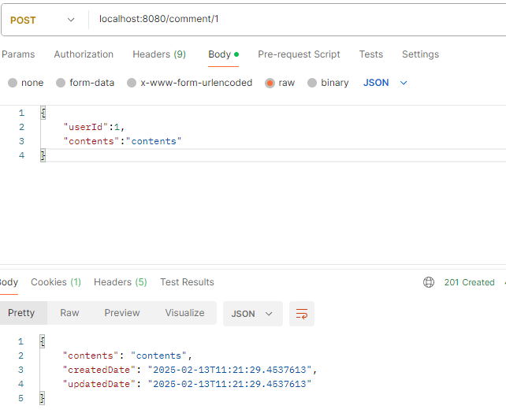

- comment read
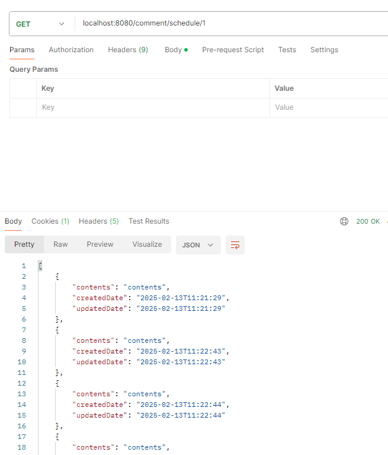
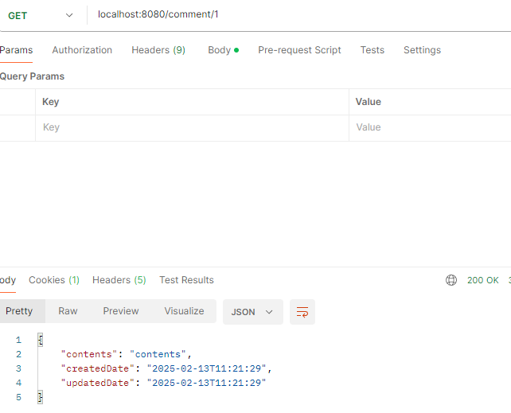

- comment update
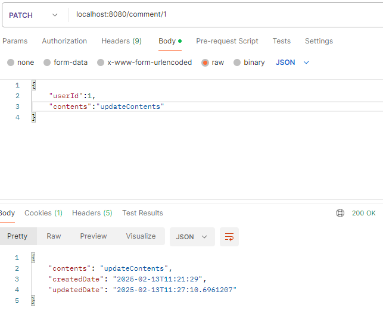

- comment delete
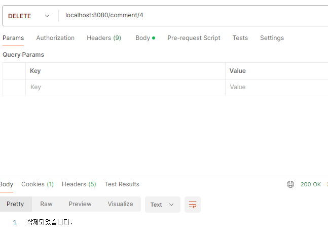

</details>

<details>

<summary><b>exception</b></summary>

- 이미 존재하는 계정(회원가입)
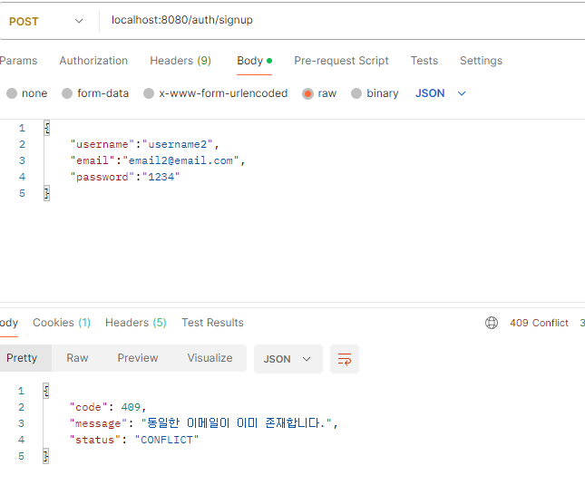

- 유효성 검사 실패
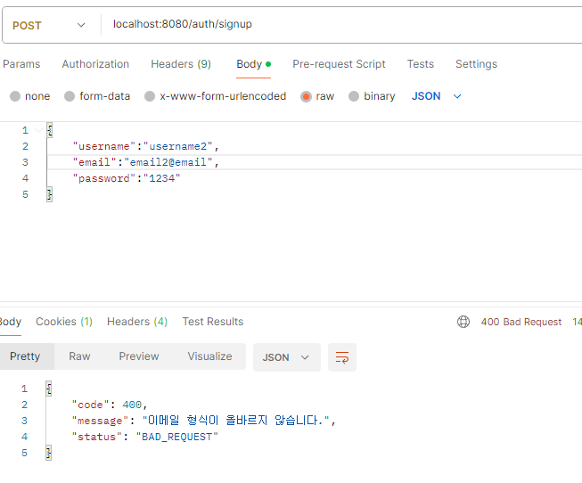
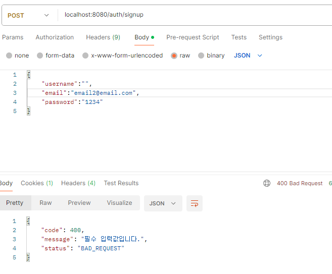
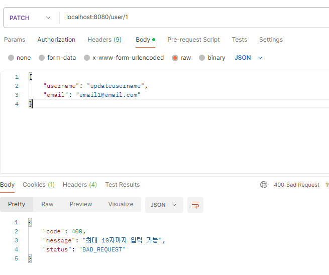

- id 불일치
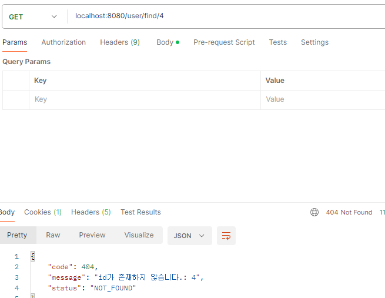

- 로그인 실패
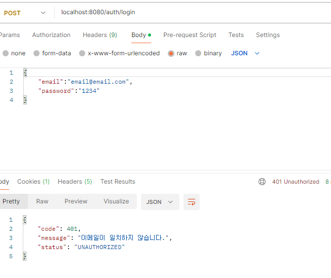

</details>
