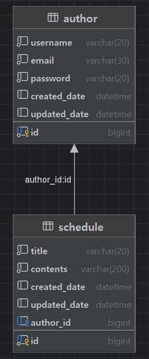
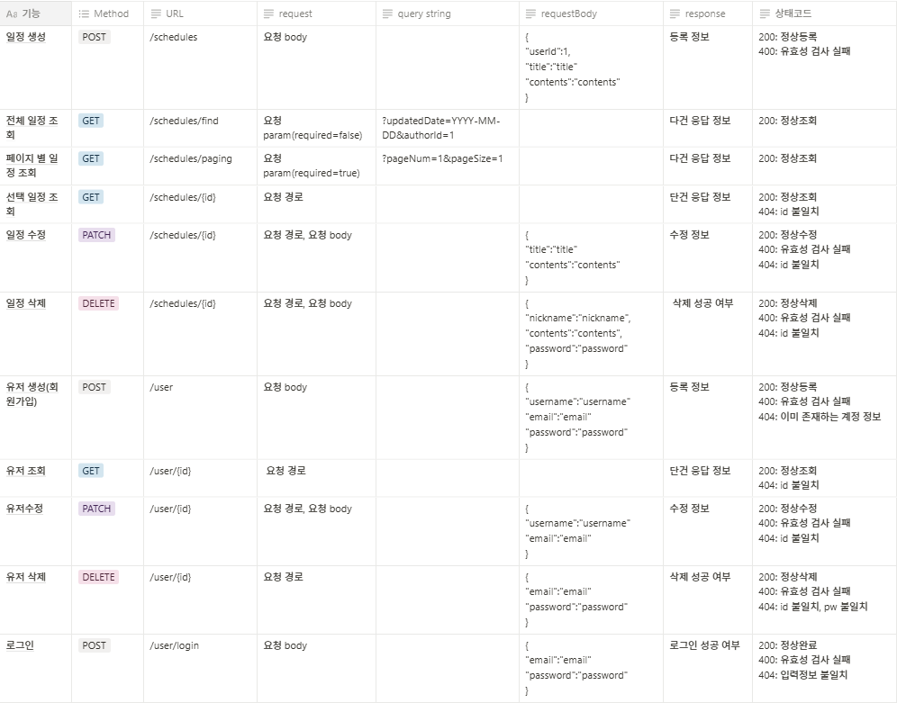

### ERD



<br>

### SQL

```sql
CREATE TABLE author
(
    id BIGINT AUTO_INCREMENT PRIMARY KEY,
    username VARCHAR(20) NOT NULL,
    email VARCHAR(30) NOT NULL,
    password VARCHAR(20) NOT NULL,
    created_date DATETIME,
    updated_date DATETIME
);

CREATE TABLE schedule
(
    id BIGINT AUTO_INCREMENT PRIMARY KEY,
    title VARCHAR(20) NOT NULL,
    contents VARCHAR(200) NOT NULL,
    created_date DATETIME,
    updated_date DATETIME,
    author_id BIGINT,
    foreign key (author_id) references author(id)
);
```
<br>

### API 명세서



- signup


- login


- schedule create


- paging
